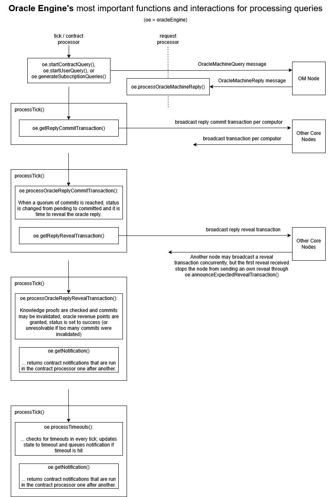

# Querying oracles from contracts

Oracles enable Smart Contracts to actively query off-chain data sources via the QPI.
When a query is initiated, the Core nodes, which run the contracts, communicate with the Oracle Machine (OM) nodes, which serve as a bridge between the Core nodes and the Oracles.
Oracles are the sources from which information can be retrieved.
They are usually independent from Qubic.
Oracles provide the queried information to the OM nodes, which send a reply back to the Core nodes.
Afterwards, the reply needs to be confirmed by the Quorum, before it is made available on-chain.

Queries to Oracles are subject to fees to avoid spam.
Those fees are destroyed (not put into execution reserve as with regular burning of QU).

The OM nodes are run by computor operators, as the Core nodes.
The participation in replying to Oracle Queries is reflected in an additional component of the computors revenue algorithm, similar to transaction counting.


## Query lifecycle and status

When a query is initiated, the following happens:

1. The fee is deduced and destroyed (if an error occurs during the start of the query, the fee is reimbursed),
2. A query ID is generated that allows to track the query,
3. The query status is set to `ORACLE_QUERY_STATUS_PENDING`,
4. The query is sent to the Oracle Machine nodes.

Afterwards, the execution (of contract code and transactions) continues.
That is, the Oracle Machine nodes process the query asynchronously.
They usually request the information from the Oracle, an external information provider, and send the reply back to the core node.
They may also get the Oracle Reply from their cache if it is already available from a prior request.

After receiving the reply, the core nodes create one reply commit transaction per computor (whereas each transaction may contain reply commits of multiple queries for increasing efficiency).
The commits consist of a digest and a knowledge proof of the Oracle Reply, but do not reveal the actual value of the Oracle Reply yet.
When 451 agreeing reply commits have been processed, the status of the query switches to `ORACLE_QUERY_STATUS_COMMITTED`.
After that, the fastest computors send a reply reveal transaction, which changes the status to `ORACLE_QUERY_STATUS_SUCCESS` and triggers the notification when executed.

As an incentive for providing fast and correct Oracle Replies, there is an oracle revenue counter for each computor, which influences the overall revenue payed to the computor at the end of the epoch.
Revenue points are granted to the first 451 reply commits (+ the ones in the same tick) with agreeing digest and correct knowledge proof when processing the reply reveal transaction.

If too many commits disagree in the digest or have wrong knowledge proof, a quorum of reply commits isn't possible anymore.
In this case, the status changes to `ORACLE_QUERY_STATUS_UNRESOLVABLE` and error notification without a valid reply is triggered immediately.

Each query is associated with a timeout in order to handle the lack of a timely reply, a quorum of commits, and/or a reveal.
When the timeout hits, the status switches to `ORACLE_QUERY_STATUS_TIMEOUT` and error notification is triggered.

All queries and replies stay available until the end of the epoch via their unique query ID.


## Query types

For contracts, there are two ways of querying Oracles:

1. One-time queries, the normal way of querying an oracle. Each of these queries is completely independent.
2. Subscriptions, a cheaper and more efficient way to query time-dependent information, such as prices, regularly. A subscription repeatedly sends the same query, only changing the query timestamp. The subscription queries may be shared by multiple contracts automatically.

Further, a one-time query can also be started by a user through a special transaction.

Here is an overview of the three types:

| | One-time contract query | Subscription contract query | One-time user query |
|--|--|--|--|
| Start | QPI call `QUERY_ORACLE` | QPI call `SUBSCRIBE_ORACLE` / scheduler | Special transaction to zero address (`OracleUserQueryTransaction`) |
| Fee | Per query (`QUERY_ORACLE`) | Per subscription (`SUBSCRIBE_ORACLE`), cheaper than many equivalent one-time queries | Per query (`OracleUserQueryTransaction`) |
| Notification | User procedure | User procedure | - |
| Timing | Minimal latency | Potentially synced with other contracts for maximal efficiency | Minimal latency |


## Oracle interfaces

An oracle interface defines the Oracle Machine input and output types: `OracleQuery` and `OracleReply`.
Multiple oracles (sources of information) may share the same input and output structs, making them accessible through the same interface.
Multiple oracle interfaces usually differ in their definition of `OracleQuery` and `OracleReply`, because they provide different types of information and require different parameter for querying the information.

An example interface is `Price`, providing access to crypto prices of multiple exchanges (oracles).
Future interfaces, that have not been implemented yet may be: `SportEvent`, `YesNoResult`, `IntResult`.
The source code of the oracles interfaces resides in the directory `src/oracle_interfaces/` of the Qubic Core repository, with one header file per oracle interface.

In the Qubic contracts, oracle interfaces are made available through the namespace `OI`.
For example, you can access the oracle query struct type of the `Price` interface via `OI::Price::OracleQuery`.


### Oracle query

The `OracleQuery` struct of the interface defines the input of the Oracle Machine, specifying what exactly is queried.
For example, the `OracleQuery` struct of the `Price` interface has the following member variables:
- `oracle`: the Oracle to ask for (e.g., binance, mexc, gate.io),
- `timestamp`: the specific date and time to ask the price for,
- `currency1` and `currency2`: the currency pair to get the price for.

In general, the `OracleQuery` struct must be designed in a way that consecutive queries with the same `OracleQuery` member values always lead the exact same `OracleReply`.
The rationale is that the oracle is queried individually by the computors and a quorum needs to agree on the exact same reply in order to confirm its correctness.
In order to satisfy this requirement, most oracle query structs will require:
- an oracle identifier, exactly specifying the source/provider, where to get the information,
- a timestamp about the exact time in case of information that varies with time, such as prices,
- additional specification which data is queried, such as a pair of currencies for prices or a
  location for weather.

If the oracle interface is supposed to support subscriptions, the `OracleQuery` struct must define a member named `timestamp` of the type `QPI::DateAndTime`.

The size of `OracleQuery` is restricted by the transaction size.
The limit is available through the constant `MAX_ORACLE_QUERY_SIZE`.


### Oracle reply

The `OracleReply` struct of the interface defines the output of the Oracle Machine, specifying which types of information are provided.

For example, in the `Price` oracle, the `OracleReply` has the member variables `numerator` and `denominator` giving the exchange rate such that `currency1 = currency2 * numerator / denominator` at `timestamp` as given by the query.

The size of both the `OracleReply` struct is restricted by the transaction size.
The limit is available through the constant `MAX_ORACLE_REPLY_SIZE`.


### Fees

The interface defines the oracle fees through the static member functions `getQueryFee()` and, optionally, if subscriptions are supported, `getSubscriptionFee()`.
They must be declared as follows:

```C++
// mandatory: get fee for regular one-time query
static sint64 getQueryFee(const OracleQuery& query);

// optional function: get one-time fee for subscription
static sint64 getSubscriptionFee(const OracleQuery& query, uint32 notifyPeriodInMilliseconds);
```

The one-time query fee needs to be paid for each call to `QUERY_ORACLE()` and as the amount of each user oracle query transaction.
It may depend on the specific query, for example, on the oracle (source providing the information).

The subscription fee needs to be paid for each call to `SUBSCRIBE_ORACLE()`, which is usually once per epoch.
It may depend on the specific query and on the notification period, that is, how often the contract wants to get notified with a new value.

For example, when writing these docs, the fee for a one-time `Price` query is 10 QU.
The fee for a `Price` subscription is 10000 QU for getting an update each minute, which means about 1 QU/query if the subscription is active in the full epoch.
A subscription querying each 2 or 3 minutes costs only 6500 QU.
The fee reduces again and again with a notification intervals of 4 minutes, 8 minutes, and following powers of 2.
While total cost of the subscription reduces, the cost per query increases (by design, because the potential efficiency gain by sharing queries between contracts reduces with the frequency).
See the comments in the source code in `src/oracle_interfaces/Price.h` for more details.

The source code of the official Qubic Core repository and release should usually tell the current oracle fees.
However, the Quorum decides as usual in Qubic, because the computors running the Qubic Network may change the code, including the fee amounts.


### Adding new interfaces

New oracle interfaces may be added by contract developers as required for their contracts with Pull Requests, see [How to Contribute](contributing.md).

A new interface should be designed in a generic way, that allows to reuse it in other contracts and applications.
For example, even if only one oracle (information provider) is supported initially, there should be an oracle member in the `OracleQuery` struct for supporting others later.

We recommend to start developing an interface by copying the file `src/oracle_interfaces/Price.h`, changing the name, and changing the content of the file.
The file must contain an oracle interface struct named the same as the filename stem, e.g., `Price` for `Price.h`.
The oracle interface struct is never instantiated, but its types and static members are available to contracts via `OI::[InterfaceName]`, for example, `OI::Price::OracleQuery` and `OI::Price::getQueryFee(query)`.

Each oracle interface is internally identified through the `oracleInterfaceIndex`, a number identifying the interface.
It has to be defined as a static member of the interface struct as follows:

```C++
static constexpr uint32 oracleInterfaceIndex = ORACLE_INTERFACE_INDEX;
```

`ORACLE_INTERFACE_INDEX` is defined in the file `src\oracle_core\oracle_interfaces_def.h`, which includes all interface header files and is discussed later below.

As mentioned in Sections above, the following structs and functions have to be defined as members of the interface struct:

```C++
struct OracleQuery
{
    // add input to OM
};

struct OracleReply
{
    // add output of OM
};

static sint64 getQueryFee(const OracleQuery& query)
{
    // Return query fee, which may depend on the specific query (for example on the oracle).
}
```

If the interface is supposed to support subscriptions, the `OracleQuery` struct must have a member `QPI::DateAndTime timestamp;`.
Further, the interface struct must define the following function:

```C++
static sint64 getSubscriptionFee(const OracleQuery& query, uint32 notifyPeriodInMilliseconds)
{
    // Return one-time fee for subscription
}
```

Additionally, the interface struct may contain other structs or convenience features for contracts using the oracle interface.

All code in the interface header file must respect the same [C++ language feature restrictions as contracts](#restrictions-of-c-language-features).
These are checked with the [Qubic Contract Verification Tool](https://github.com/Franziska-Mueller/qubic-contract-verify).

A new oracle interface has to be added file `src/oracle_core/oracle_interfaces_def.h`.
Search for "add new interface above this line" in this file to see, where to add references to new interface to make it available to contracts and the oracle engine.

Another mandatory requirement for a new interface is adding a reference implementation of the oracle service counterpart in [Oracle Machine repository](https://github.com/qubic/oracle-machine/).
This repository references the original interface definition from the Qubic Core repository via a git submodule.
For testing before the new interface is merged to the official repository, we recommend to replace the submodule with a reference to your own fork of the Core.

Please note that structs such as `OracleReply` may have some padding (gaps, unused bytes for better alignment in the memory).
Make sure that `OracleReply` is set to all-0 before setting the member data, so that alignment/padding bytes are initialized with 0 and that no memory content of the OM node is published on-chain.


## Notifications

As mentioned above, `QUERY_ORACLE()` and `SUBSCRIBE_ORACLE()` just start the query and subscription asynchronously and return without a reply.
The contract is notified about success or error through an asynchronous call to a special notification user procedure, usually multiple ticks later (exception are a few error cases that trigger the notification immediately, such as not having enough QU to pay the fee).
Notifications are run by the system after execution of transactions (user procedures) but before `END_TICK` (with 0 invocation reward and originator/invocator `NULL_ID`).


### Defining notification procedures

An oracle notification procedure must have the input type `OracleNotificationInput<OracleInterface>` and the output type `NoData`.
It may be defined with or without locals.

For example, a notification procedure for the `Price` oracle may be defined like this:

```C++
typedef OracleNotificationInput<OI::Price> NotifyPriceOracleReply_input;
typedef NoData NotifyPriceOracleReply_output;
struct NotifyPriceOracleReply_locals
{
    OI::Price::OracleQuery query;
};

PRIVATE_PROCEDURE_WITH_LOCALS(NotifyPriceOracleReply)
{
    if (input.status == ORACLE_QUERY_STATUS_SUCCESS)
    {
        // get and use query info if needed
        if (!qpi.getOracleQuery<OI::Price>(input.queryId, locals.query))
            return;

        // use example convenience function provided by oracle interface
        if (!OI::Price::replyIsValid(input.reply))
            return;

        // process reply ...
    }
    else
    {
        // handle failure ...
    }
}
```

The `OracleNotificationInput<OracleInterface>` input has the members:

- `sint64 queryId`: ID of the oracle query that led to this notification (or -1 in case of an early error, before a query ID has been assigned),
- `sint32 subscriptionId`: ID of the oracle subscription or -1 in case of a one-time oracle query,
- `OracleInterface::OracleReply reply`: Oracle reply to query (type `OI::Price::OracleReply` in the example above), only valid if `status` is `ORACLE_QUERY_STATUS_SUCCESS`,
- `uint8 status`: Oracle query status as defined in `src/network_messages/common_def.h`; one of `ORACLE_QUERY_STATUS_SUCCESS`, `ORACLE_QUERY_STATUS_TIMEOUT`, `ORACLE_QUERY_STATUS_UNRESOLVABLE`, or `ORACLE_QUERY_STATUS_UNKNOWN` (in case of an early error, before the query has been started).

Usually, the notification procedure should be a `PRIVATE_PROCEDURE` or `PRIVATE_PROCEDURE_WITH_LOCALS`.
If you define it as a `PUBLIC_PROCEDURE`, other contracts may invoke it, what you probably want to avoid.


### Registering notification procedures

In order to make the procedure usable as a notification, it must be registered with `REGISTER_USER_PROCEDURE_NOTIFICATION()` in `REGISTER_USER_FUNCTIONS_AND_PROCEDURES`.

However, it should **NOT** be registered for external access with `REGISTER_USER_PROCEDURE()` as most other user procedures.
Otherwise, if registered with the latter, any user can invoke your notification procedure through a transaction.

In the example above, `REGISTER_USER_FUNCTIONS_AND_PROCEDURES` may look like this:

```C++
REGISTER_USER_FUNCTIONS_AND_PROCEDURES()
{
    REGISTER_USER_PROCEDURE_NOTIFICATION(NotifyPriceOracleReply);

    // REGISTER_USER_PROCEDURE calls, none for NotifyPriceOracleReply !!!

    // REGISTER_USER_FUNCTION calls
}
```


## Query QPI

### Sending out a query

As mentioned above, oracles are queried asynchronously, because it takes at least 7 ticks until the reply is committed and revealed.

A contract can initiate a query using the `QUERY_ORACLE()` macro, which takes the following parameters:

- `OracleInterface`: Oracle interface struct of the interface to query, e.g., `OI::Price`,
- `query`: Instance of type `OracleInterface::OracleQuery` containing details about which oracle to query for which information, as defined by the specific oracle interface,
- `userProcNotification`: User notification procedure that shall be executed when the oracle reply is available or an error occurs (must be registered, see [Registering Notification Procedures](#registering-notification-procedures)),
- `timeoutMillisec`: Maximum number of milliseconds to wait for the reply. Reasonable values are 30000 or 60000 (30 or 60 seconds). Too low values may lead to always getting timeout errors.

The macro returns the Oracle query ID that can be used to get the status of the query, or -1 on error.

Here is an example of how to use this macro:

```C++
locals.queryId = QUERY_ORACLE(OI::Price, locals.priceOracleQuery, NotifyPriceOracleReply, 60000);
```

This call will automatically burn the oracle query fee as defined by the oracle interface.
More specifically, it will destroy the QUs without adding to the contract's execution fee reserve.
It will fail if the contract doesn't have enough QUs.

The notification callback will be executed when the reply is available or on error.
The callback must be a user procedure of the contract calling `QUERY_ORACLE()` with the procedure input type `OracleNotificationInput<OracleInterface>` and `NoData` as output.
The procedure must be registered with `REGISTER_USER_PROCEDURE_NOTIFICATION()` in `REGISTER_USER_FUNCTIONS_AND_PROCEDURES`.

In the notification callback, success is indicated by `input.status == ORACLE_QUERY_STATUS_SUCCESS`.
If an error happened before the query has been created and sent, `input.status` is `ORACLE_QUERY_STATUS_UNKNOWN` and `input.queryId` is -1 (invalid).
Other errors that may happen with valid `input.queryId` are `input.status == ORACLE_QUERY_STATUS_TIMEOUT` and `input.status == ORACLE_QUERY_STATUS_UNRESOLVABLE`.

All queries, including pending queries are discarded at the end of the epoch. Contracts aren't notified in this case.

An alternative way of initiating periodic queries is using subscriptions, see the [Subscription QPI](#subscription-qpi)


### Getting the query status by query ID

A contract can get the status of any query by the query ID as in this example:

```C++
output.status = qpi.getOracleQueryStatus(input.queryId);
```

The returned status is one of the following:

- `ORACLE_QUERY_STATUS_UNKNOWN`: Query not found / not valid.
- `ORACLE_QUERY_STATUS_PENDING`: Query is being processed.
- `ORACLE_QUERY_STATUS_COMMITTED`: The Quorum has committed to an oracle reply, but it has not been revealed yet.
- `ORACLE_QUERY_STATUS_SUCCESS`: The oracle reply has been confirmed and is available.
- `ORACLE_QUERY_STATUS_UNRESOLVABLE`: No valid oracle reply is available, because computors disagreed about the value.
- `ORACLE_QUERY_STATUS_TIMEOUT`: No valid oracle reply is available and timeout has hit.


### Getting the query by query ID

A contract can get the query data of any query given it knows the query ID and the associated oracle interface. Example:

```C++
if (qpi.getOracleQuery<OI::Price>(input.queryId, locals.priceQuery))
{
    // use locals.priceQuery
}
```

This tries to get the query data associated with the query identified by `queryId`.
If `queryId` is valid and matches with the oracle interface given via the template parameter (`OI::Price` in this example), `locals.priceQuery` (which must be of type `OI::Price::OracleQuery` in this example) is set and the function returns true. Otherwise it returns false.


### Getting the reply by query ID

A contract can get the reply data of any query given it knows the query ID and the associated oracle interface. Example:

```C++
if (qpi.getOracleReply<OI::Price>(input.queryId, locals.priceReply))
{
    // use locals.priceReply
}
```

This functions returns wether `queryId` is found, matches the oracle interface, and a valid reply is available (query status is `ORACLE_QUERY_STATUS_SUCCESS`).
If all this is true, the function copies the oracle reply into `locals.priceReply`, which must be of type `OI::Price::OracleReply` in this example.


## Subscription QPI

Subscriptions are a cheaper and more efficient way to query time-dependent information, such as prices, regularly.
A subscription repeatedly sends the same query, only changing the query timestamp.
The subscription queries may be shared by multiple contracts automatically.

After subscribing, updated information is pushed to the subscriber contract in defined intervals as requested.
Internally, a scheduler takes care for translating subscriptions into bundled one-time queries, whose reply may be delivered to multiple contracts.

Subscriptions end with the epoch. That is, contracts must subscribe again in a new epoch, even if the epoch transition is seamless.

A subscriptions usually costs a higher fee than a single one-time query, but a lower fee than replacing the subscription with recurring one-time queries (because resources are saved when multiple contracts subscribe to the same oracle “channel”).


### Subscribing

A contract can subscribe for regularly querying an oracle using the macro `SUBSCRIBE_ORACLE()`, which expects the following parameters:

- `OracleInterface`: Oracle interface struct of the interface to query that supports subscriptions, e.g., `OI::Price`,
- `query`: Instance of type `OracleInterface::OracleQuery` that specifies which information is requested, e.g., the oracle and currencies in `OI::Price`.
  It must have a member `DateAndTime timestamp` that can be set by the scheduler.
- `notificationCallback`: User notification procedure that shall be executed when the oracle reply is available or an error occurs (must be registered, see [Registering Notification Procedures](#registering-notification-procedures)),
- `notificationPeriodInMilliseconds`: Number of milliseconds between consecutive queries/replies that the contract is notified about. Currently, only multiples of 60000 are supported and other values are rejected with an error.
- `notifyWithPreviousReply`: Whether to immediately notify this contract with the most up-to-date value if any is available.

The macro returns the Oracle subscription ID or -1 on error.

Here is an example of how to use this macro:

```C++
output.subscriptionId = SUBSCRIBE_ORACLE(OI::Price, input.priceOracleQuery, NotifyPriceOracleReply, input.subscriptionPeriodMilliseconds, input.notifyPreviousValue);
```

Subscriptions automatically expire at the end of each epoch.
So, a common pattern is to call `SUBSCRIBE_ORACLE()` in `BEGIN_EPOCH`.

Subscriptions facilitate sharing common oracle queries among multiple contracts.
This saves network resources and allows to provide a fixed-price subscription for the whole epoch, which is usually much cheaper than the equivalent series of
individual `QUERY_ORACLE()` calls.

The `SUBSCRIBE_ORACLE()` call will automatically burn the oracle subscription fee as defined by the oracle interface
(burning without adding to the contract's execution fee reserve).
It will fail if the contract doesn't have enough QUs.

The notification callback will be executed when the reply is available or on error.
The callback must be a user procedure of the contract calling `SUBSCRIBE_ORACLE()` with the procedure input type `OracleNotificationInput<OracleInterface>` and `NoData` as output.
The procedure must be registered with `REGISTER_USER_PROCEDURE_NOTIFICATION()` in `REGISTER_USER_FUNCTIONS_AND_PROCEDURES`.

In the notification callback, success is indicated by `input.status == ORACLE_QUERY_STATUS_SUCCESS`.
If an error happened before the query has been created and sent, `input.status` is `ORACLE_QUERY_STATUS_UNKNOWN` and `input.queryId` is -1 (invalid).
Other errors that may happen with valid `input.queryId` are `input.status == ORACLE_QUERY_STATUS_TIMEOUT` and `input.status == ORACLE_QUERY_STATUS_UNRESOLVABLE`.
The timeout of subscription queries is always 60000 milliseconds.

A contract may subscribe to the same oracle interface with multiple different queries.
However, it cannot subscribe with the same query multiple times.
In order to change the notification period of an existing query, it needs to be unsubscribed first and subscribed again afterwards.


### Unsubscribing

A contract can unsubscribe from an own subscription with the subscription ID returned by the `SUBSCRIBE_ORACLE()` call as illustrated in the following example:

```C++
output.success = qpi.unsubscribeOracle(input.subscriptionId);
```

The function returns true if the subscription given by the ID has been stopped (false means that the ID is invalid).

If there is a pending query initiated for this subscription while unsubscribing, the contract will still be notified for that query even after unsubscribing.
However, no new queries for this contract will be generated.


## IDs

### Query ID

The query ID is a signed 64-bit integer, with values >= 0 being reserved for valid query IDs and values < 0 reserved for signalling errors.

Query IDs are unique.
They are constructed from the tick, when the query was initiated and an index during the tick.

For user queries, the index is given by the index of the query transaction in the tick data.
For contract one-time queries and subscription queries, the index is generated sequentially, starting at the maximum number of transactions per tick.

With that index and the query tick, the ID is generated `queryId = (tick << 31) + index` (shift the tick by 31 bits and add the index).


### Subscription ID

The subscription ID is a signed 32-bit integer.
Valid IDs are >= 0.
Negative values are reserved for signaling errors.

A subscription ID is bound to an oracle interface and specific initial query passed to `SUBSCRIBE_ORACLE()`.
Multiple contracts (subscribers) may share the same subscription ID, but have individual notification periods.

Subscription IDs are generated sequentially, that is, if there are N subscriptions they will have the IDs 0, 1, ..., N-1.


## Tools

The command-line tool [qubic-cli](https://github.com/qubic/qubic-cli) provides useful commands for debugging and experimenting with oracles.
For example:

- `qubic-cli [...] -queryoracle`: Command for generating a user query to an oracle. Run this to get help how to use it.
- `qubic-cli [...] -getoraclequery`: Command for getting information about oracle queries. Run this to get help how to use it.
- `qubic-cli [...] -getoraclesubscription`: Command for getting information about oracle subscriptions. Run this to get help how to use it.
- `qubic-cli [...] -querypriceviacontract`: Send price query via contract. Useful for testing contract queries and subscriptions. Run this to get help how to use it.

Another useful tool for debugging your contract in the Core when running a testnet is [qlogging](https://github.com/qubic/qlogging/).
This prints the event log messages emitted by the core, including messages for oracle query state changes and subscribing/unsubscribing.


## Implementation details


