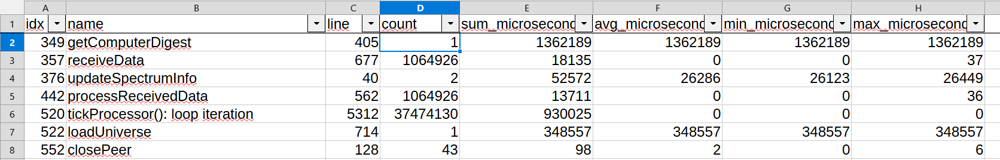

# How to Contribute

## Table of contents

1. [Contributing as an external developer](#contributing-as-an-external-developer)
2. [Development workflow / branches](#development-workflow--branches)
3. [Coding guidelines](#coding-guidelines)
    1. [Most important principles](#most-important-principles)
    2. [General guidelines](#general-guidelines)
    3. [Style guidelines](#style-guidelines)
4. [Version naming scheme](#version-naming-scheme)
5. [Profiling](#profiling)

## Contributing as an external developer

If you find bugs, typos, or other problems that can be fixed with a few changes, you are more than welcome to contribute these fixes with a pull request as follows.
For big changes, such as adding a smart contract, we recommend to discuss with one of the core developers first.

1. Create your own fork of this repository on GitHub.
2. Clone your fork on your local machine. Your remote repository on GitHub is called origin.
3. Add the original GitHub repository as a remote called upstream.
4. If you have created your fork a while ago, pull upstream changes into your local repository.
5. Create a new branch from `develop`.
6. Fix the bug, correct the typo, solve the problem, etc. Make sure to follow the coding guidelines below.
7. Commit your changes to your new branch. Make sure to use a concise but meaningful commit message.
8. Push your branch to the remote origin (your fork on Github).
9. From your fork on GitHub, open a pull request (PR) in your new branch targeting the `develop` branch of the original repo. In the PR, describe the problem and how your changes solve it.
   After requesting / getting a review, do not rebase and force-push your changes.
   Instead, merge changes of other branches if your branch needs to be updated.
10. If the PR reviewer requests further changes, push them to your branch. The PR will be updated automatically.
11. When your PR is approved and merged, you can pull the changes from upstream to your local repo and delete your extra branch.

For developing a smart contract, also see [contracts.md](contracts.md).

## Development workflow / branches

We use a mixture of [GitFlow](https://www.atlassian.com/git/tutorials/comparing-workflows/gitflow-workflow) and a [trunk-based-process](https://www.atlassian.com/continuous-delivery/continuous-integration/trunk-based-development) with the following branches:

1. `main`: The code base that is officially deployed. Releases are created from this branch.
Changes should NOT be committed here directly but merged from other branches after testing.
Exception: If the current release (such as v1.191.0) has a critical bug, the fix may be committed to the main branch directly (followed by creating a bugfix release such as v1.191.1 after testing the fix).

2. `develop`: Our current testing branch, which will be automatically deployed to the testnet in the future.
Most changes should either be committed here (if they are trivial) or in feature branches (whenever a change may cause trouble in testing, may not be ready for the next release, and/or requires code review).
Feature branches should be created from `develop` and pull requests (PR) should target `develop`.
Before committing to this branch or creating a PR, please check that everything compiles and the automated tests (gtest) run successfully.

3. `feature/YYYY-MM-DD-FeatureName`: When we are working on a specific feature that is non-trivial (more than a few lines) and/or requires code review, a feature branch should be created from `develop`.
The commits in this branch do not need to be fully functional, but before creating a pull request, you should check that the final commit compiles and the automated tests (gtest) run successfully.
If the code passes the PR review, it can be merged to the `develop` branch for testing.
(The idea is to test the changes in an accumulated way in the testnet, assuming that most changes work and do not require debugging. This should be easier than deploying each feature branch in the testnet separately.)
If code changes are very complex, they should be tested with a separate testnet before merging the PR.
The feature branch should be deleted after merging with the PR.
Optionally, for branches that do not implement new features, other prefixes may be used, such as: `doc/YYYY-MM-DD-Name`, `bugfix/YYYY-MM-DD-Name`, `refactor/YYYY-MM-DD-Name`.

4. `testnet/YYYY-MM-DD-FeatureOrReleaseName`: This is a temporary branch used for the testnet, building on feature branches or the `develop` branch. It contains at least one commit that adapts the code as required for running in the testnet.
We will delete testnet branches that have not been changed for one month or longer. And they may be cleaned up before by their owner (the developer who created it) to avoid cluttering the repository with unused branches.

5. `release/v1.XYZ`: This is a release branch for a specific version, usually for a new epoch.
It should be created from the 'develop' branch after testing the new features and agreeing on what is supposed to be included in the release.
This branch is then merged to the main branch via PR before creating the release on the main branch.
The branch may be deleted after merging.
However, it may be necessary to later recreate the branch if an old release needs to be fixed or updated, such as for creating the rollback version v1.190.1 for epoch 94.
Alternatively, to simplify the workflow of creating releases, creating the release branch may be skipped if no changes are required compared to the develop branch, directly creating the release PR with the develop branch.

For each release, there will be a tag like `v1.XYZ.N`.
The release description should contain the target epoch number and a short change log.


## Coding guidelines

The coding guidelines are meant to support the team of contributors in creating and maintaining clean, readable, secure, bug-free, and efficient code.

### Most important principles

- Security and stability are of utmost importance!
  Funds must be safe.
  Any attack surface must be avoided or minimized.
- The implementation of public interfaces (network messages, transactions, ...) must check all inputs for invalid data, preventing vulnerabilities for attacking.
- The software must be extensively tested to ensure that it functions as expected and runs stable in the EFI environment on bare metal.
  Testing especially must be thorough for changed parts.
  The code also should be tested with invalid input and other potential attack scenarios as far as possible.
  Testing has two independent parts:
     - isolated testing of components with the Google Test framework in the "test" project running in OS / dev environment and
     - testing of the full Qubic Core in the target environment (EFI bare metal) in a testnet with multiple nodes (supported by test team).

  You find more information about testing in the [dedicated README](../test/README.md).

- Efficiency, fast execution of smart contracts, and sub-second transaction finality are among the key features of Qubic.
  New code should be efficient and not compromise these features.

### General guidelines

- Make sure that all code in the branches `main` and `develop` always compiles without errors and warnings.
  Change the code to fix warnings, not the compiler options!
  Also check that the "test" project runs without errors.

- Review the diffs of your changes before committing (or at least before creating a PR of your branch) and undo unintended / irrelevant changes that blow up the diff and hamper reviewing and merging.

- Request reviews. All non-trivial changes should be reviewed by at least one other Core development team member.
  Pull requests by external developers ideally should be reviewed by two experienced Core development team members.
  After requesting / getting a review, do not rebase and force-push your changes to the PR branch.
  Instead, merge changes of other branches if your branch needs to be updated.

- Whenever possible, add test cases to the Google Test project "test" for new features.
  This helps to automate testing and cope with the increasing complexity of the code.
  It not only enables easy interactive debugging in the dev environment (in contrast to debugging in EFI), but also increases chances that bugs introduced by future changes are discovered early.

- Modularize the code in manageable units, at least in different files, ideally also within classes that provide an easy-to-use interface and restrict access to critical internal data (using private and protected).
  Ideally, related global variables should be encapsulated in global objects, restricting write access and reducing risks of wrong use by providing the appropriate methods (object member functions).

- Make each header file self-sufficient by having it include all its dependencies.
  Add `#pragma once` on top as an internal include guard.
  There are exceptions to these rules for smart contracts and the contract system of Qubic.

- In the Core, platform dependent code (which differs between EFI vs OS, or between different compilers) should reside in the directory `src/platform`, in order to simplify:
  (1) potential future porting endeavors and
  (2) testing of the Core code in the "test" project (Google Test running in OS dev environment).
  The code in `src/platform` is meant to be an abstraction layer hiding technical details and providing basic functions,
  not including any of the business logic of the Qubic Core or dependencies to other files of the repository from outside `src/platform`.

- Names (of functions, classes, structs, variables, constants, types etc.) should be self-explanatory, especially in public scope.
  A rule of thumb is that the length of a variable name should be somewhat correlated to the size of its scope.
  For example, in global scope naming should be precise and self-explanatory, while in a trivial loop the counter may be named `i` or `c`.

- Add comments to your code, documenting things that are not obvious but relevant for other developers or your future self.
  This especially is important for public interfaces, their inputs and outputs, for public variables and constants.
  The preferred syntax of comments is `//`.

  Some examples that should be documented for function interfaces:
    - meaning of return value (if it is not obvious from the function name),
    - information about the inputs that is not obvious from the name (such as range or unit),
    - which of the function parameters serve as outputs,
    - requirements for calling (such as: only safe to call on tick or contract processor; assumes that lock XYZ is locked; hints for potential race conditions).

  Inside complex functions, comments should summarize the main steps, for example with one headline comment per logical block of code.
  The comments should be specific and concise.

- Update the docs (comments and markdown files) if they get outdated by your code changes.

- Add code to check assumptions and requirements about variables, data types, values of constants etc.:
    - Use compile-time checks with `static_assert` if possible.
    - Use explicit checking and error handling / reporting (with `if (...) {}`) for external inputs and public state variables, for everything that is exposed to a big amount of code, receives inputs from the user or the network, depends on EFI functions, and any other check that does not clearly qualify for an `ASSERT`.
    - Use `ASSERT(condition);` to check assumptions and invariants that should hold true if the implementation of a component is correct, for example, preconditions and postconditions about the internal state of an object, as well as preconditions of an internal function that the calling function has to ensure.
    These checks are executed at run-time, but in EFI Qubic Core only if it is compiled in debug mode, without defining the preprocessor symbol `NDEBUG`.
    This makes `ASSERT` valuable for bug checking without having any computational cost in the final deployment.
    Another advantage is its simplicity, because it directly emits a message to `debug.log` if the Core is built in debug config and the condition is not met.
    However, in EFI Qubic Core, execution continues after a failed `ASSERT`.
    Always make sure that checking the assert condition has no side effect.

- Be aware of parallel execution of code in the different processors (main loop, request processors, tick processor, and contract processor).
  Prevent race conditions in concurrent read/write access to shared data by locking resources before use.
  Use atomic operations and locking provided in `src/platform/concurrency.h` and `src/platform/read_write_lock.h`.

- Make sure that you do not leak any resources, such as allocated memory, file handles, and mutual exclusion locks.
  Do not forget to release/free/close the resource at any branch of execution, including for example, early returns and error handling.

- Avoid code duplication. If non-trivial code needs to be used at multiple places, it should reside in a commonly used function instead of being copy-pasted.

- Keep the scope of variables small. Make sure they are initialized.

- Floating point data types (`float` and `double`) cannot be used in the Core, because their arithmetics is not well-defined and may lead to inconsistencies between nodes.

- Prefer constants over variables and use `const` or `constexpr` by default (unless the value is supposed to be changed).
  An exception are function parameters passed by value, because they are rarely declared `const` and doing so may cause confusion (for example, the `const` in `void f(const int x);` is uncommon and may be skipped).
  However, input parameters that are passed by reference should be `const` (for example, `void f(const ArrayType& x)` and `void f(const ArrayType* x)`).

- Make member functions `const` by default (unless the object's observable state is supposed to be changed).

- Prefer `constexpr` over `#define` for defining constants.
  Sets of constants that belong together may be defined with `enum`.

- Prefer functions over preprocessor macros. Macros can be used when something cannot be implemented with a function.

- If preprocessor macros are used, name them `ALL_CAPS` in order to make them visible to humans. But prefer `constexpr` and functions when possible.

- Pass objects to functions by reference if there is no good reason to copy them.
  Use const references for input parameters and non-const references for output and input/output parameters.
  Input of built-in types and their aliases (that fit into a CPU register = up to 8 bytes) should be passed by value.
  Use a pointer (`T*`) if "no argument" is a valid option (`nullptr` = no argument).
  Otherwise, prefer references (`T&`).

- Be aware of alignment of struct/class member variables and try to avoid padding.
  This is especially relevant if the data structure is replicated often in containers (like arrays) or if it is transmitted in network messages.

- For readability, use `class` rather than `struct` if any member is non-public.

- Avoid "magic numbers"; use symbolic constants with a self-explanatory name.

- With pointers, use `nullptr` instead of `NULL` or `0` (because it cannot be confused with int).

- Be aware of ranges of integer types and potential overflows and underflows. Either prevent or properly handle them.

- Make sure to prevent division by zero. Also applies to modulo `%`.

- Prefer the quoted form of `#include` for files relative to the including file (`"relative/path"`) and the angle bracket form (`<file>`) everywhere else.


### Style guidelines

The code formatting rules are enforced using `clang-format`, ideally setup as a pre-commit hook.
They are based on the "Microsoft" style with some custom modifications.
Currently, the style guidelines are designed to improve consistency while minimizing the number of changes needed in the existing codebase.

#### Naming

The following naming rules are not strictly enforced, but should be followed at least in new code:

- **Preprocessor symbols** must be defined `ALL_CAPS`.

- **Filenames** should be all lowercase and can include underscores (`_`) to separate words. The extension of header files is `.h` and of source files `.cpp`.
  Example: `public_settings.h`.

- All **types** (classes, structs, type aliases, enums, and type template parameters) start with a capital letter and have a capital letter for each new word, without underscores.
  Examples: `BitArray`, `UInt8`, `RequestContractIPO`.
  Exceptions: structs of inputs, outputs, and locals of contract functions and procedures must be named `[NAME]_inputs`, `[NAME]_outputs`, and `[NAME]_locals` with `NAME` being the name of the corresponding contract function or procedure.

- **Variables** are named similar to types, but starting with a lower case letter. Each additional word after the first starts with a capital letter, without separating words by underscores.
  Examples: `numberOfTransactions`, `thisIsAVariable`.
  Special cases:

  - **Member variables of classes** may begin with an underscore `_`.
    In member functions, this helps to clarify that the referenced variable is an object member variable. Example: `_contractIndex`.
    Member variables of structs without member functions should not begin with an underscore, because they are accessed via `object.member` or `pointer->member` anyway.

  - **Global variables** may begin with the prefix `g` in order to clarify its global scope. Example: `gTickNumberOfComputors`.

- **Constants** commonly are defined `ALL_CAPS` if they are global.
  Some of them need to be defined as preprocessor symbols to enable conditional compilation.
  However, since we also have constant objects, arrays, and encourage to use const variables, using the naming rules of variables is often a better choice.
  In consequence, the following rules apply:
    - Global constants can be defined `ALL_CAPS` or `likeVariables`, but preprocessor constants should always be `ALL_CAPS`.
    - Constants with more limited scope should be named `likeVariables`.

- **Functions** are named following the same pattern as variables. They usually start with a verb. Examples: `getComputerDigest()`, `processExchangePublicPeers()`, `initContractExec()`.

#### Curly Braces Style

Every opening curly brace should be on a new line. This applies to conditional blocks, loops, functions, classes, structs, etc. For example:

```
if (cond)
{
   // do something
}
else
{
   // do something else
}
```


## Version naming scheme

`vX.Y.Z`

Starting with `v1.225.0` naming follows this scheme:

If two versions' `X`s and `Y`s are the same, the versions are compatible and can tick together. `Z` is incremented for changes that do not break compatibility.

If `X` or `Y` change, compatibility is broken and computor operators MUST update their nodes.

Examples changes that require increment of `X` or `Y`:

- adding a contract
- changing a contract procedure
- anything that may influence digests


## Profiling

The header file `src/platform/profiling.h` provides features for profiling code, that is, measuring how often some code is executed and how long it takes.

### How to implement profiling

Profiling is supported through the class `ProfilingScope`, which measures run-time between construction and destruction of an instance.
Its most common use case is in local scope, measuring how often a blocks inside a function is executed and how much run-time is spent there.
It may also be used as a member of an object, for measuring the number of objects constructed / destructed and their life-time.
However, in EFI it cannot be used in global scope, because constructor and destructor of global objects are not called without the standard runtime library.

The common use case of measuring a code block is supported by a set of preprocessor macros:

- `PROFILE_SCOPE();` measures the run-time from this point to the end of the scope.
  When the execution leaves the scope, the run-time measurement is added and the execution counter is incremented.
  This macro can be only used once per scope.
  The measurements are identified by the function name `__FUNCTION__` and the source code line `__LINE__`.
- `PROFILE_SCOPE_BEGIN();` and `PROFILE_SCOPE_END();` are similar to `PROFILE_SCOPE()`, but the end of the profiling scope is defined explicitly here.
  They can be used multiple times in a scope, because the macros create an additional block between begin and end.
- `PROFILE_NAMED_SCOPE(name);` is like `PROFILE_SCOPE()`, but measurements are identified by the string `name` (instead of the function name) and the source code line.
  The `name` should be a `const char*` literal, such as `"my fancy code"`, because the pointer must stay valid until the program is stopped.
- `PROFILE_NAMED_SCOPE_BEGIN(name);` and `PROFILE_SCOPE_END();` are like using `PROFILE_SCOPE_BEGIN()` and `PROFILE_SCOPE_END()`,
  but the measurement is identified by the passed `name` as in `PROFILE_NAMED_SCOPE(name)`.

In order to enable profiling with these macros, you need to define the preprocessor symbol `ENABLE_PROFILING`.
Ideally, you do this globally in the compiler configuration.

Here is an example of how to use the macros:

```C++
void processTick()
{
    // measure all of processTick():
    PROFILE_SCOPE();

    // other code ...

    // measure code until leaving the scope that is ended with PROFILE_SCOPE_END(); may be also left with return, break etc.
    PROFILE_NAMED_SCOPE_BEGIN("processTick(): BEGIN_TICK");
    contractProcessorPhase = BEGIN_TICK;
    contractProcessorState = 1;
    WAIT_WHILE(contractProcessorState);
    PROFILE_SCOPE_END();

    // other code ...

    if (isMainMode())
    {
        // measure code until scope is left
        PROFILE_NAMED_SCOPE("processTick(): broadcast custom mining shares tx");

        // ...
    }
}
```

### Overhead of profiling

If `ENABLE_PROFILING` is not defined, the macros introduced above will resolve into nothing, leading to no overhead independently of how often these macros are used in the code.

If `ENABLE_PROFILING` is defined, the macros add some code for measuring run-time, counting execution, and storing data in a hash map.
Although the profiling is designed to minimize overhead, the execution of the profiling code costs some run-time.

As a consequence, profiling of code blocks that are run extremely often -- like millions or billions of repetitions per second -- may significantly slow down the execution.

Thus, it doesn't work out well to add profiling to each and every function.
The best strategy to find code for optimization is to add profiling code in a top-down manner.
That is, start with adding profiling to top-level functions.
After finding the most expensive functions, add profiling to parts of these functions and to the second-level functions that are called by the top-level functions.
This may be repeated for third-level functions, fourth-level functions etc.


### Output of profiling

If `ENABLE_PROFILING` is defined, the file `profiling.csv` will be created in the Qubic EFI build when:

1. the node is shutdown with the ESC key or the remote special command request,
2. the state is saved after hitting the F6 key,
3. the snapshot (state including all tick data) is saved by regular auto-save or the F8 key.

The file `profiling.csv` contains comma-separated values.
The first line is the header of the table, containing the column names.
The rest of the file has one line per scope of measurement, each with one value per column.
Profiling scopes that were not executed, don't appear in the file.

These are the columns in the file:
- `idx`: Index of the measured data in the hash map. (Not relevant for the user but good to check the quality of the hash function.)
- `name`: The name of the measurement or the name of the function if `PROFILE_SCOPE()` or `PROFILE_SCOPE_BEGIN()` was used.
- `line`: The source code line, where measurement starts.
- `count`: How often this code has been executed, that is, the total number of run-time measurements of this code.
- `sum_microseconds`: The total time spent for executing this code block, given in microseconds.
- `avg_microseconds`: The average time spent for executing this code block, given in microseconds. This is computed by dividing sum by count.
- `min_microseconds`: The minimum run-time measured for executing this code block, given in microseconds.
- `max_microseconds`: The maximum run-time measured for executing this code block, given in microseconds.

We recommend to open the file `profiling.csv` with a spreadsheet application, such as LibreOffice Calc.
When opening the file, you may see an import dialog.
Make sure to select "UFT16" as file encoding and "comma" as delimiter / separator.

In order to simplify analyzing the file, we recommend the following:
1. Enable "AutoFilter", which adds filtering and sorting functions to the header row of each column.
   In LibreOffice Calc, you should be able to toggle the AutoFilter feature with the shortcut CTRL+SHIFT+L.
2. If all the rows don't fit on your screen, you can fix the first row, keeping it visible even if you scroll down.
   This feature is often available in the view menu of the application, in a submenu named like "freeze pane", "fix cells", or something similar.
3. If you want to continue analyzing the file later, save it in the native format of the spreadsheet application, such as ODS.
   This way, the AutoFilter and other changes will be kept when you reopen the file.

After loading the file and activating the AutoFilter, you should see something like this:



If you are interested in finding the bottlenecks, you may start analyzing the profiling results with sorting by the column `sum_microseconds`.
Go through the results starting with the highest total run time until you find entries with values that are higher than expected.
These are candidates for digging deeper and potential targets for optimization.

If you compare different runs (files), be aware of the the different total run-times.
For example, if you want to compare optimization attempts of a specific measurement scope, you should focus on average, minimum, and maximum instead of the total sum.
Additionally, you should make sure that the conditions of the runs you compare are as similar as possible.
If the runs involve random factors, running the tests for longer may help to average out random effects.


### Some implementation details

The current implementation uses the time stamp counter (TSC) of the processor, which can be queried very efficiently, leading to quite low profiling overhead.
An underlying assumption in the Qubic code is that TSC is increased with a constant frequency.
Most modern x64 CPUs should have an invariant TSC, whose frequency is constant.

"In general, the TSC should not be used to take very short time measurements, because the resulting measurement is not guaranteed to be identical each time it is made.
The RDTSC instruction (unlike the RDTSCP instruction) is not serializing, and can be executed out-of-order with respect to other instructions around it.
Even when bound by serializing instructions, the system environment at the time the instruction is executed can cause additional cycles to be counted before the TSC value is loaded."
[AMD64 Architecture Programmer's Manual, Volumes 1-5, 13.2.4 Time-Stamp Counter](https://www.amd.com/content/dam/amd/en/documents/processor-tech-docs/programmer-references/40332.pdf)

Another rich source: [Intel® 64 and IA-32 Architectures Software Developer's Manual Combined Volumes: 1, 2A, 2B, 2C, 2D, 3A, 3B, 3C, 3D, and 4](https://cdrdv2.intel.com/v1/dl/getContent/671200)


